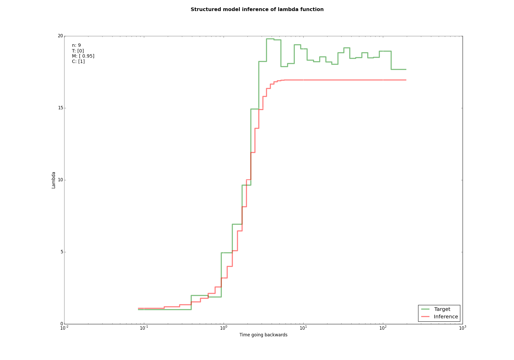

## Symmetrical Island Model with Changes in Migration Rates - Inference

The Symmentrical Island Model with Changes in Migration Rates (StSICMR) is a model developped by [Oliver Mazet](http://fr.viadeo.com/fr/profile/olivier.mazet1) and [Lounès Chikhi](https://www.wikiwand.com/en/Loun%C3%A8s_Chikhi) with their research team.

This repository supposes that you are familiar with 

## Setup

All of the code has been tested on Python 3.4 and Ubuntu 14.04. This should work fine on a different OS, however Python 3.x is highly recommended.

### Normal

The following module versions were used, that said older and newer versions have a good chance of working too.
	
	- Cython == 0.22.1
	- matplotlib == 1.4.3
	- numpy == 1.9.2
	- scipy == 0.15.1

If you do not have them installed type

```sh
cd /StSICMR-Inference
pip3 install -r requirements.txt
```
	
If you don't have ``pip`` installed then you can install the modules manually, this should be easy on any platform as all of them are extremely popular modules. 

In order to compile some Python code into C code you also have to type

```sh
cd /lib/cython/
./compile.sh
```

### With a virtual environment

If you want to be safe and not mess with your Python environment you can create a [virtual environment](http://docs.python-guide.org/en/latest/dev/virtualenvs/) by doing the following steps.

**1. Clone the repository**

```sh
git clone https://github.com/MaxHalford/StSICMR-Inference
cd StSICMR-Inference
```
	
**2. Create and activate a virtual environment**

```sh
virtualenv -p /usr/bin/python3 venv
source venv/bin/activate
```
	
**3. Install requirements**

```sh
pip3 install -r requirements.txt
```

**4. Compile Python code to C code**

```sh
cd lib/cython
./compile.sh
```

This creates a sandboxed Python where you can do as you please without fear of screwing up your setup. The only thing required is to have Python 3.x installed in order to run ``virtualenv env``. To deactivate the virtual environment type ``deactivate``. To activate it type ``source venv/bin/activate``, if you don't the default Python interpreter will be used. You can delete the ``StSICMR-Inference`` folder and it will be as if nothing ever happened.

## Usage

### Command line arguments

### Examples

The following commands use PSMC files provided by [Willy Rodriguez](https://github.com/willyrv).

#### First example

```sh
python3 infer -f examples/example1.psmc -i 100 -s 0 -p 1000 -r 1 -g 25 -u 1 -m least_squares -k True
```

`

#### Second example

```sh
python3 infer -f examples/example2.psmc -i 100 -s 4 -p 1000 -r 1 -g 100 -u 2 -m integral -k True
```


### Advice

## Architecture & explanation

    StSICMR-Inference/
        -results/
        -lib/
            -cython/
                -build/
                    -temp.linux-x86_64-3.4/
                        -cythonized.o
                -profile.sh
                -compile.sh
                -setup.py
                -cythonized.pyx
                -cythonized.c
            -__pycache__/
            -__init__.py
            -cythonized.so
            -plotting.py
            -model.py
            -psmcfit.py
            -genalg.py
        -README.md
        -infer
        -requirements.txt
        -LICENSE
        -example.psmc
        -architecture.md

[cprofilev](https://github.com/ymichael/cprofilev)

## Contact

If you have questions about the mathematics please send a mail to <willyrv@gmail.com>.

If you have questions about the genetic algorithm and/or the code please send a mail to <maxhalford25@gmail.com>.

## License

See [LICENSE](LICENSE)
